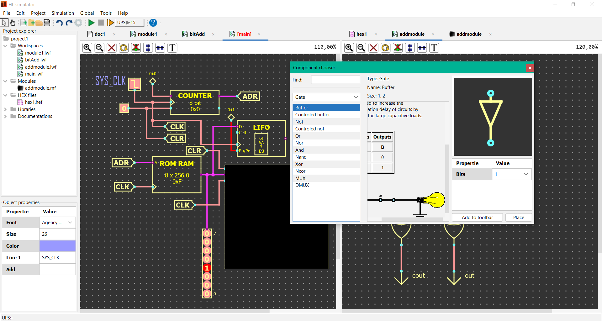
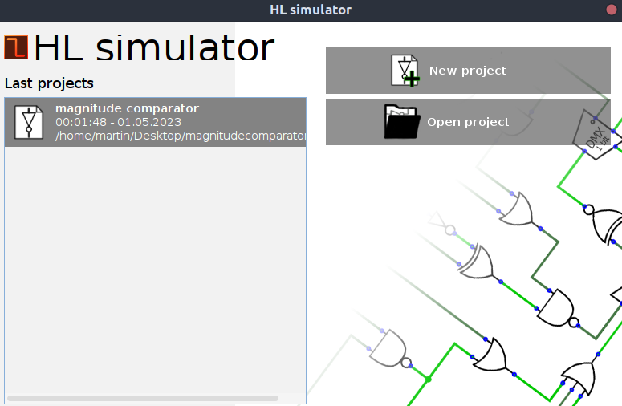
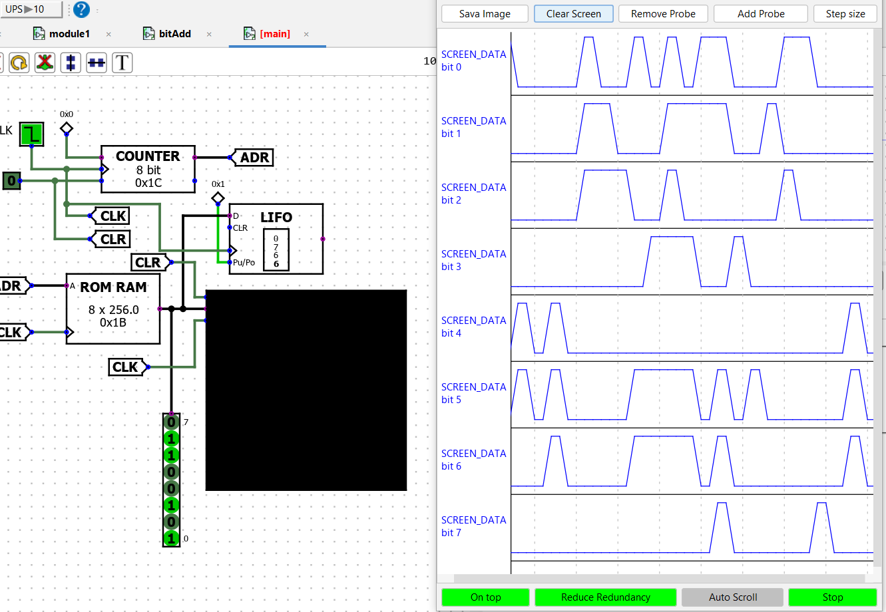
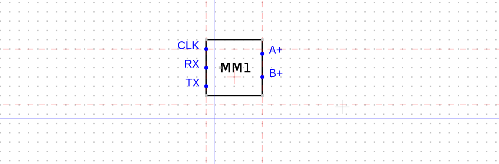
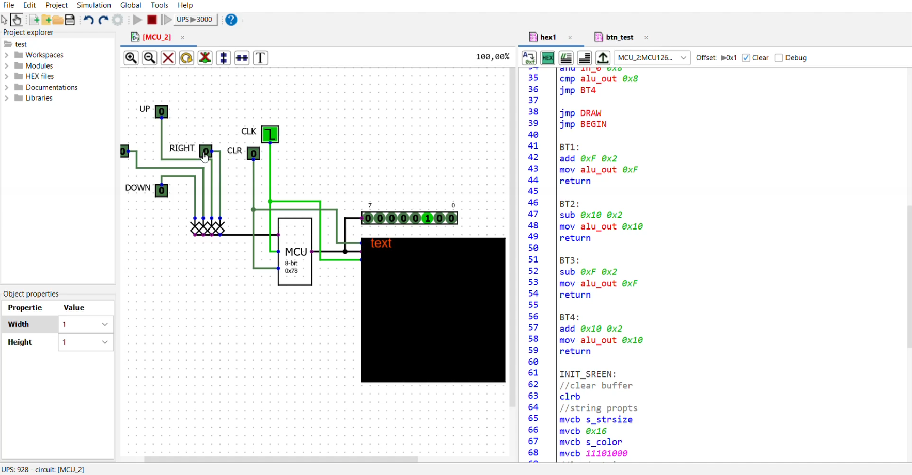
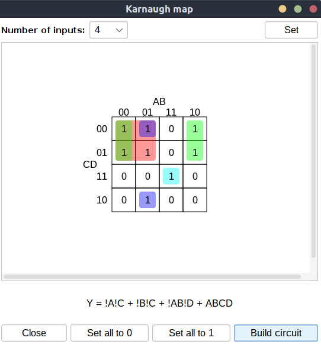

	
	
<b>v 0.9.0 - now only works properly on Windows</b>

	<h1>HL simulator</h1>

HL Simulator is a circuit simulation tool that enables users to design and simulate sequential and logic circuits of various complexities. This application is built with Java and offers an intuitive interface for creating, editing, and simulating circuits.

With HL Simulator, users can easily build complex circuits by selecting from a wide range of built-in logic gates and other circuit components. The application supports simulation of both synchronous and asynchronous circuits, allowing users to observe how their circuits behave over time.

HL Simulator offers a range of simulation options, including smooth simulation at adjustable speeds and step-by-step simulation. This makes it easy for users to track the behavior of their circuits as they change over time.

Overall, HL Simulator is an essential tool for any electrical engineer or hobbyist looking to design and simulate complex circuits with ease.

## Workspace

## Project Wizard

	

## Diagnostic tools

Software also provides several diagnostic tools. The first of these is the step-by-step simulation feature, which allows users to easily track the behavior of the circuit.

Additionally, HL simulator includes a digital grapher (oscilloscope), which enables real-time monitoring of the states in any part of the circuit. With these powerful diagnostic tools, users can quickly identify and troubleshoot any issues that arise during circuit design and testing. 

There is also Karnaugh map tool, which allows for easy definition of combinational circuit behavior and automatically generates the output equation and circuit from it.

Furthermore, the simulator includes a debugger for ASM language programming, making it easier to debug and test programs written in assembly language. With these additional features, HL simulator provides a comprehensive suite of tools for both circuit design and microprocessor programming.

## Modules

Another important feature of HL Simulator is the ability to create circuit modules that can be reused in other parts of the circuit. This significantly simplifies the design process and allows for the creation of much more complex circuits. 

Once a module is created, it can be easily imported into other circuits, making it possible to build larger and more intricate systems. This feature also enables the creation of a library of standard modules that can be shared and reused across different projects, promoting greater collaboration and efficiency in the design process.

## ASM language programmer

HL simulator also offers a built-in environment for developing simple applications in assembly language. The software allows for programming virtual microprocessors and their corresponding instruction sets. Once the program is compiled, it can be uploaded in binary format to the chosen ROM memory (external or internal) with which the microcontroller communicates. When the simulation is started, the program execution begins and can be observed in real-time. This feature provides a convenient way to test and debug microcontroller programs without the need for hardware.

## Karnaugh map
Furthermore, HL Simulator also offers a tool for diagnosing combinational circuits called "Karnaugh map." This tool allows defining the behavior of the combinational circuit directly in the map and then automatically generates the output equation and builds the circuit from it. This significantly simplifies the process of designing and implementing combinational circuits.

	

## Direct connection with external devices

The software communicates over the serial link with an external device that processes messages. This enables the external device to directly control some states in the simulator or indicate certain states of the simulator externally.

## Keyboard shortcuts
* Global
	* CTR + ENTER: (new file, new component)
	* CTR + Q: control mode
	* CTR + E: edit mode	
	* CTR + Right mouse button: remove reference component from toolbar
* Workspace
	* CTR + C: copy objects
	* CTR + V: paste objects
	* CTR + R: rotate object/ selection
	* CTR + A: select all objects
* Module editor
	* CTR + X: set logic model
	* CTR + C: copy
	* CTR + V: paste
 
## TO DO:
* linux project save/open bug
* workspace: vertical/horisontal align
* fix ASM current instruction highlighter
* history (endo, redo)
* component: CPU, TCP/IP T/R, Timer on, Timer off, Timer pulse
* workspace better circuit handler: bridge wire separator algorithm, 2D path finder
* global settings
* printing of circuits
* update system 
* better UI for library info 
* changing of language
* documentation / tutorials [EN]
  
## Author:
HL Simulator was created as an open-source project by Martin Krčma. The project is available on the [GitHub] platform and can be modified and distributed in accordance with the terms of the GNU General Public License v3.0.
